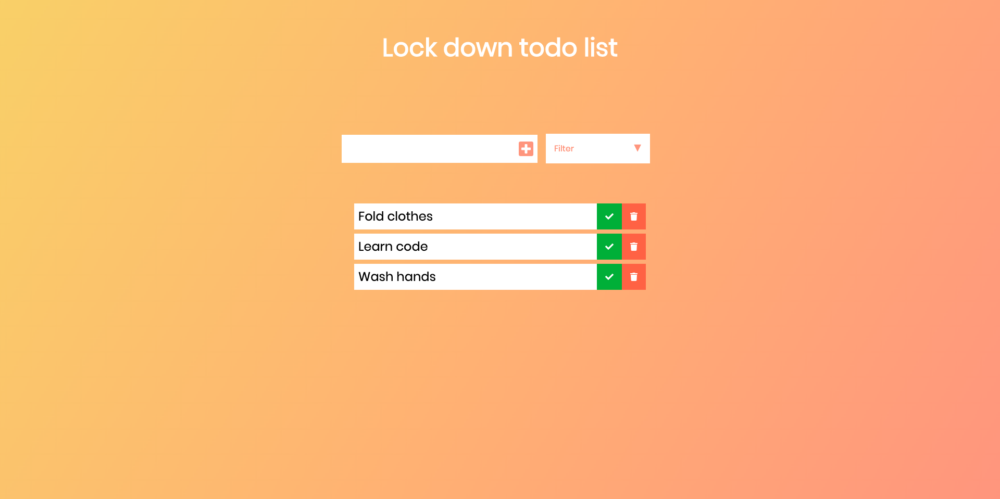

# todo

<b>To do List project<b>

You can add a task to the list and complete it. This will also allow you to filter your taks between: All, Completed and Uncompleted.
You will be able to delete the to do with the trash can icon, or check the tick icon to complete it. 
My personal goals when creating this was to understand:
<ul>
    <li>How to create variables.</li>
     <li>How to create event listeners with a click function.</li>
     <li>Understanding what functions are.</li>
     <li>Creating divs dynamically and appending them to their parent.</li>
     <li>Understanding what local storage is.<li>
</ul>

Click the image below to see it in action.

